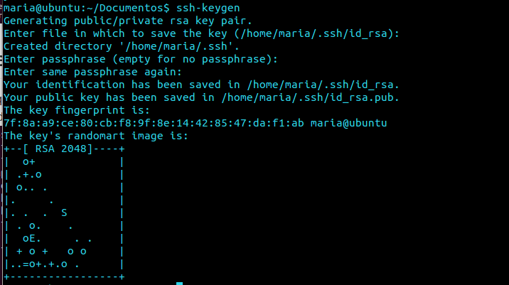

Practica 1 - STW
=============


rvm
--

Instalamos rvm utilizando el siguiente comando:
```sh
\curl -L https://get.rvm.io |    bash -s stable --ruby --autolibs=enable --auto-dotfiles

```


git
--

Ya tenemos instalado git, ahora lo que hacemos es generar una clave publica para sincronizar nuestro PC con la cuenta de GitHub:

Ahora añadimos dicha clave a la cuenta de GitHub.

